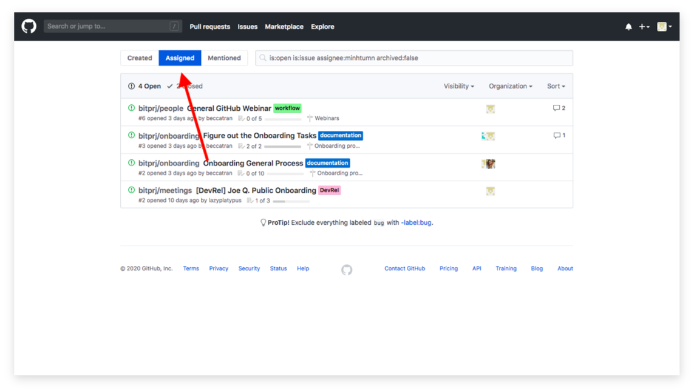
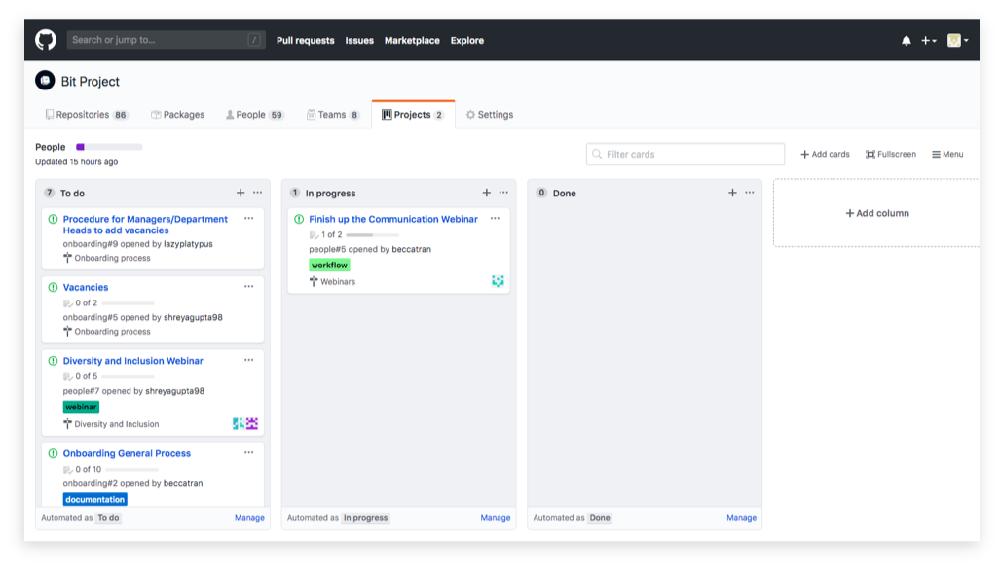
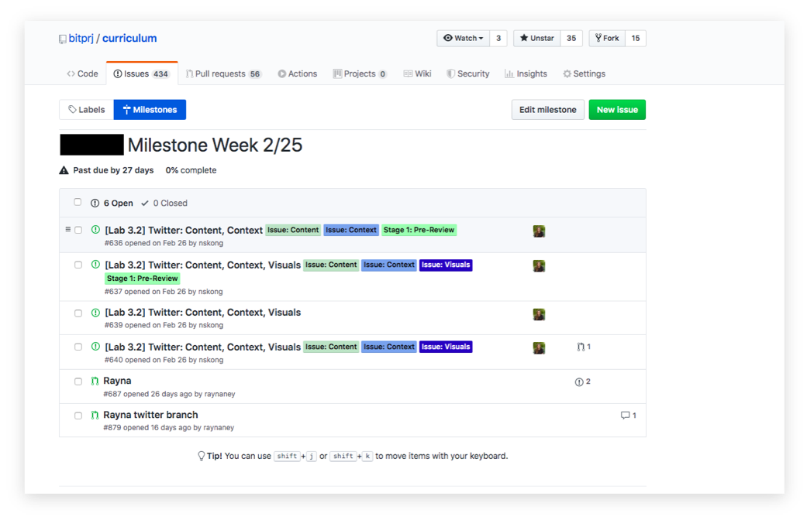
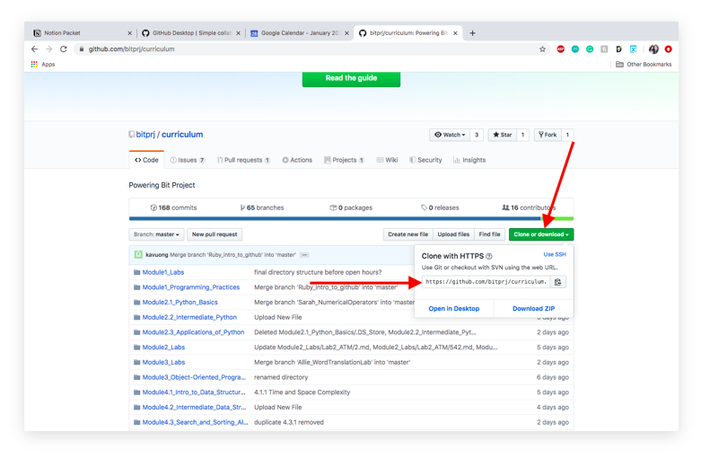
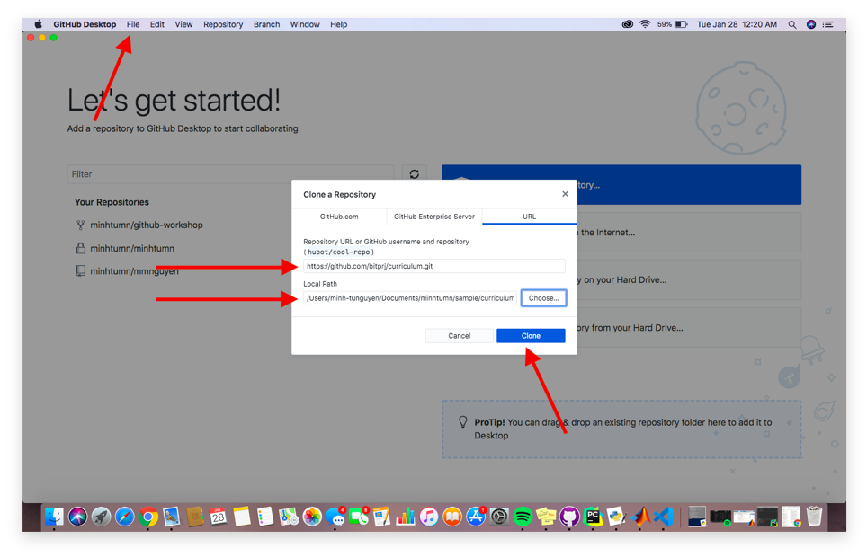
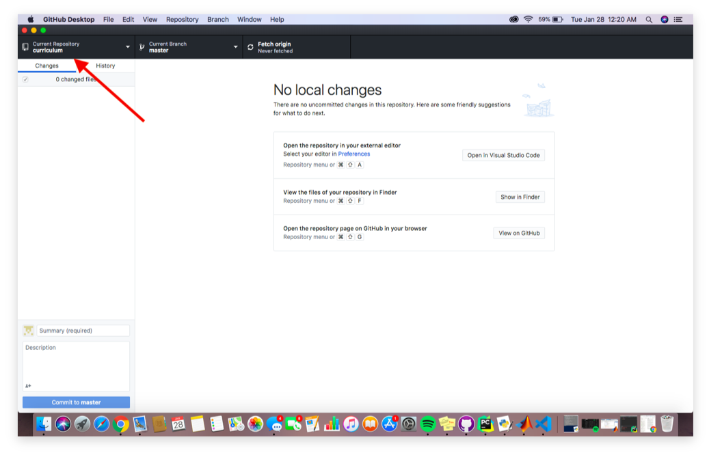
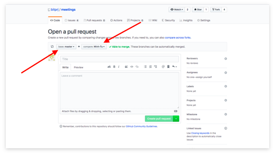

# GitHub Basics



## Goal

Here at Bit Project, we have decided to fully transition our operations to GitHub. We hope to have all of our materials located on a single platform for easy access and efficiency.

The goal of this webinar is to help you understand the **basics of GitHub**. These skills will help you be successful at Bit Project, no matter which team you are on.

## **What is GitHub?**

GitHub is a website that allows developers to store their files onto a singular platform, making collaboration with others easy and simple.

The material transferred onto GitHub will be made public, fulfilling our goals of having an open-source and transparent workflow.

### **GitHub Vocabulary**

#### **Repository**

_A repository is like a folder_. It holds all the elements and files of a certain project, including codes, documentation, and so on. It also stores all historical revisions \(similar to Google Docs\).

#### **Clone**

This is a copy of the GitHub repository on your computer that is utilized to make your own revisions _without making any changes to the official version_.

#### **Branch**

A branch is created within a repository. It is like a copy of the repository and can be edited. Any edits made here _will not affect the master branch_ until the edits are merged into the main branch.

#### **Master Branch**

This is the official branch that contains the final product of the repository’s project. All changes from other branches are merged into this branch.

#### **Commit**

Commit is essentially a _save button_ but for GitHub. This program keeps a record of the changes you make through this command.

#### **Push**

This command sends your changes \(after you commit\) to the repository on the GitHub website.

#### **Pull**

The Pull command fetches any changes made and merges them into the file. If someone made changes to the repository, pull those changes into your copy to have the latest version.

#### **Pull Request**

Pull requests are _proposed changes from a contributor_ \(someone without official access to the main branch\). When they make edits to the repository through their own copy, they can submit a request to have the changes added into the master branch.

#### **Merge**

Merge takes the changes in one branch and adds them into another. This usually occurs after a pull request is approved by a collaborator \(one who has access to freely make changes within the repository\).

#### **Open Source**

Open source is the idea of collaboration that everyone can access, edit, and contribute to a project.

## **GitHub Issues**

### **What is an Issue?**

Issues are ways for members of the GitHub to _suggest improvement, assign tasks, or ask questions_ for a specific project repository.

Anyone is able to create an issue and assign the issue to a member\(s\) of their choice. Each one also contains their own discussion forum, making comments and quick conversation easy as it is all in one place.

### Where to Find Your Issues

#### **Created Issues**

Open the Bit Project GitHub.

At the top of the page, click on _Issues_ to find all the issues that are connected to you.

Once clicked, it will direct you to a page with all the issues that you have created.

#### **Assigned Issues**

From clicking on _Issues_ at the top of the page, you are directed to the page of your created issues.

Towards the top left, select _Assigned_ to find the issues that were assigned to you.

Your manager/reviewer is in charge of assigning you your issues.

#### **Mentioned Issues**

From clicking on _Issues_ at the top of the page, you are directed to the page of your created issues.

Towards the top left, select _Mentioned_ to find the issues that your username was mentioned in.

## **Issues for Projects & Milestones**

### **What are Projects & Milestones?**

#### **Projects**

These Project Boards allow us to _track the progress_ of the project, providing a visual to how close a project is to being completed. It is made up of issues and pull requests.

#### **Milestones**

Milestones are _issue trackers_. Managers are able to easily see which issues are open/closed and how much progress is made.

### **Examples for Projects & Milestones?**

#### **Projects**

The image displays an example of a Project Board. It is split into three sections: _To do, In Progress, and Done_.

Issues are placed into their respective columns depending on their given status.

#### **Milestones**

The milestone consists of all of the developer’s issues that they must complete.

A due date is assigned and a percentage is displayed, informing the reviewer/manager of how much work the developer has completed.

## **GitHub Desktop**

### **What is GitHub Desktop?**

GitHub Desktop is an application specifically designed for a fast, easy way to contribute to GitHub. It simplifies the workflow that GitHub requires.

No matter if you are a beginner or an experienced user of GitHub, we advise you to download and utilize GitHub Desktop to make your work easier.

### **GitHub Desktop Set-Up**

#### **Step 1: Downloading GitHub Desktop**

Download Github Desktop at[ desktop.github.com](https://desktop.github.com/)**.** Follow the procedure of downloading the application.

**Step 2: Configuring GitHub**

Connect Github Desktop to your choice of Bit Project Repository \([github.com/bitprj](https://github.com/bitprj)\).

Use the _search bar_ to find your repository of choice, or scroll through the selection of repositories.

**Step 2 \(Cont\): Configuring GitHub**

If you have not already, click on the repository of your choice.

Towards the right, click on the green button: _Clone or download_. The dropdown will provide a link you need to copy.

#### Step 3: Open GitHub Desktop

Open your GitHub Desktop Application. Once you open it, it should display a window like the one on the right.

#### Step 4: Cloning Your Repository

At the top left, select _File_. Then select _Clone repository_ in the drop down.

Paste the _URL link_ from Step 2 into the URL text box. Change the local path to an empty file within your computer system.

Click on _Clone_.

#### **You’re All Set!**

The Bit Project repository of your choice should now be connected to your Github Desktop.

Note that you have to follow the same procedure every time you want to edit the items in a different repository.

### **Using GitHub Desktop**

#### **Step 1: Creating a Branch**

Go to the Bit Project Github repository of your choice. Under the _Code_ tab, click on the button called _Branch: master_. A drop-down menu should appear and allow you to type in the search bar.

**Step 1 \(Cont.\): Creating a Branch**

Type in a new and unique name for a branch, following the format:

_FN\_Name\_of\_Activity_

Select _create branch: FN\_Name\_of\_Activity._

Once you create your branch, you will make all of your changes to the files within this branch.

#### **Step 2: Using Desktop**

Refer to the GitHub Desktop Set-Up section if you do not have your repository set up.

Click _Fetch \(or Pull\) Origin_ at the top of the window. This “fetches” the latest version of the repository. Select the branch that you previously created for yourself.

#### **Step 2 \(Cont.\): Using Desktop**

Open the repository in your _external editor_ of your preference.

**Step 3: Text Editor**

In your choice of text editor, select the specific file for the card that needs editing.

Once you open it, make the necessary changes to it \(refer back to the issues on GitHub\).

Save your edits on the text editor. Github Desktop will detect the changes.

**Step 3 \(Cont.\): Text Editor**

Save your edits on the text editor. GitHub Desktop will detect the changes.

**Step 4: Committing**

Click on the _Commit_ button on the bottom-left corner of Github Desktop.

The changes are saved to the branch, but the changes are not registered in Github just yet.

**Step 5: Pushing**

There are two ways to push.

1. Click on the blue button _"Push"_ that appears in the light blue box stating that you have a push. 

2: Select Repository near the top left of the screen. From the drop-down menu, select _push_. This officially brings the saved changes to the Github repository.

#### Now What?

Your edits have been saved into the branch that you have created on both GitHub Desktop and GitHub.

Now, create a _Pull Request_ to tell those who have access to the master branch that you would like to make these changes.

### **Making a Pull Request**

#### **Step 1: GitHub Website**

After pushing your edits on GitHub Desktop, return to the GitHub website.

Within the code tab, there should be a notification of your recently pushed branches. Select the green button of _Compare and Pull request_.

#### **Step 2: Creating the Request**

Your _base_ should be the _master_ branch while the compare should be your branch.

#### **Step 2 \(Cont.\): Creating the Request**

The _title_ should accurately reflect the changes that you are requesting to make.

**Step 2 \(Cont.\): Creating the Request**

In the _comment section_, include all the issues you are resolving if this is what you were assigned to do. \(i.e., Resolve Issue \#...\)

**Step 2 \(Cont.\): Creating the Request**

Write a brief description of the changes you are requesting the collaborators to pull.

**Step 2 \(Cont.\): Creating the Request**

Change the _Assignee_ to your manager.

Select the label most relevant to the pull request.

**Step 2 \(Cont.\): Creating the Request**

Then, press on the big green button of _Create pull request_.

After this, you’re done! Your manager will be notified of this request and will review your work before deciding if your edits should be merged into the master branch.

## **Markdown & Typora**

### **What is Markdown?**

Markdown is a syntax that _formats text on web pages_. It is a set of rules that you follow to adjust your text characteristics \(bold, italics, etc.\), headings, lists, bullet points, etc.

Its simplicity allows users to easily pick up the formatting, as it was purposely designed to be easily read and written in.

### **What is Typora?**

Typora is a text editing software that supports most, if not all, Markdown elements.

This application is ideal due to its simple beginner-friendly style. With the keyboard shortcuts for Markdown formatting options, beginners will have an easy time getting used to Markdown and Typora.

### **Typora Resources**

Typora Download: [https://www.typora.io/](https://www.typora.io/)

Typora / Markdown Reference: [https://support.typora.io/Markdown-Reference/](https://support.typora.io/Markdown-Reference/)

Typora Tutorials: [http://support.typora.io/style/](http://support.typora.io/style/)

### **Connecting Typora to GitHub Desktop**

#### **Step 1: Open GitHub Desktop Preferences**

Open your GitHub Desktop. In the top right corner, select the bolded words of _GitHub Desktop_. In the dropdown menu, select _Preferences_.

#### **Step 2: Preferences Settings**

In the Preferences window, go to _Integrations_. Then click the dropdown menu for _External Editor_ and select _Typora_.

Click _Save_.

#### **You're All Set!**

Your GitHub Desktop should now be connected to Typora. When you want to edit files, they will now open directly in Typora.

### **Using Typora with GitHub Desktop**

The steps are the same as any standard application.

Refer to Using GitHub Desktop. _\*\*_

