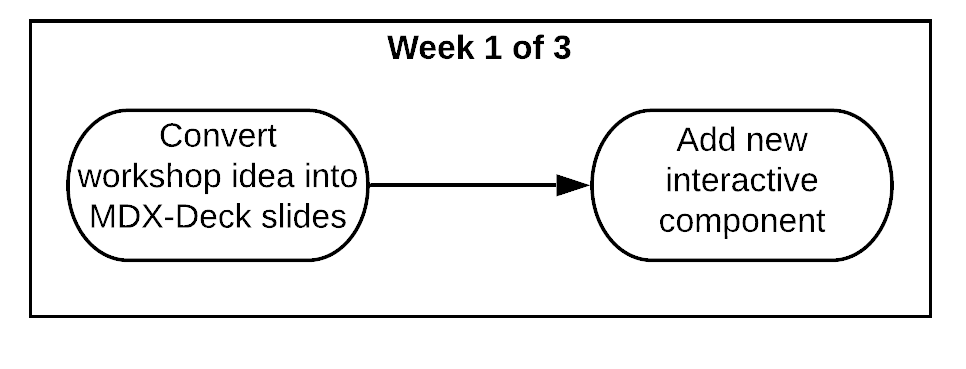

# Responsibilities for Choosing Your Idea

## Week 1 of 3: Getting Ideas on \(MDX-Deck\) Paper

**Week 1 Checklist for Developers**

_This checklist should have the label `weekly-dev`with a title format: \[Topic Name\] \[Project Name\]  Week 1 of 3: Dev Tasks._

* [ ] Go through entire workshop
  * [ ] Make sure it **completely works on your computer**\* ****
  * [ ] Understand at a high level what is happening
* [ ] Convert workshop idea into MDX-Deck Slides on bitprj/mdx-deck
  * [ ] Make speaker notes for all slides
* [ ] Add new interactive component
* [ ] Finalize date and time of presentation \(in Week 3\) with Head
* [ ] General Slide Checklist Fulfilled

#### Week 1 Checklist for Managers

_This checklist should have the label `weekly-manager`with a title format: \[Topic Name\] \[Project Name\]  Week 1 of 3: Manager Tasks._

* [ ] Ensure they have `mdx-deck` working on their computers
* [ ] Come up with specific action plan for how devs will convert slides
* [ ] Discuss with devs to coordinate and confirm the interactive component
* [ ] Confirm date and time of presentation in Week 3 with head and devs
* [ ] "General Manager Responsibility" checklist should be completed 

It's important to get started on the right foot. For this week, it is imperative that all managers coordinate and determine **specific steps** for the developers to complete their tasks. **Communication of these responsibilities is key.**

## Week 2 of 3: Finalizing Materials

#### Week 2 Checklist for Devs

_This checklist should have the label `weekly-dev`with a title format: \[Topic Name\] \[Project Name\]  Week 2 of 3: Dev Tasks._

* [ ] Finalize slides per manager's feedback
* [ ] Convert slides into lab format
* [ ] Prepare presentation
  * [ ] Finalize speaker notes
  * [ ] Confirm date and time with Head

#### Week 2 Checklist for Managers

_This checklist should have the label `weekly-manager`with a title format: \[Topic Name\] \[Project Name\]  Week 2 of 3: Manager Tasks._

* [ ] Follow-up with devs to **completely finalize slides**
* [ ] Delegate **specific responsibilities for lab conversion**
* [ ] Provide insight on all speaker notes for every slide
* [ ] Dry run entire presentation 
* [ ] Double-check with head on time of the presentation

This week, managers should be finalizing the workshop and direct the process of lab conversion. Speaker notes should be documented for every slide, and a separate meeting from the 1-1 should be set-up to dry run the entire presentation.

Note that for this week, devs should work in both [bitprj/mdx-deck](https://github.com/bitprj/mdx-deck) for their slides and [bitprj/curriculum](https://github.com/bitprj/curriculum) for their labs. There should be a folder set-up for them to make their activity.  

## Week 3 of 3: Presentation, Implementing Feedback

#### Week 3 Checklist for Devs

_This checklist should have the label `weekly-dev`with a title format: \[Topic Name\] \[Project Name\]  Week 3 of 3: Dev Tasks._

* [ ] Conduct Zoom Presentation
* [ ] Integrate all Feedback on Slides, Lab and Presentation

#### Week 3 Checklist for Managers

_This checklist should have the label `weekly-manager`with a title format: \[Topic Name\] \[Project Name\]  Week 3 of 3: Manager Tasks._

* [ ] Follow-up with devs to **integrate all feedback on slides, lab and presentation**
* [ ] Attend devs' presentation and submit feedback

Feedback should be submitted on the slides and lab as comments on your pull request to `master`. Presentation feedback should be put together in a .md file and posted to the repository bitprj/mdx-deck, under the folder `pres-feedback`. By the end of the week, the slides and lab should be **fully complete,** and the duo should move on to their next workshop project after this week.

