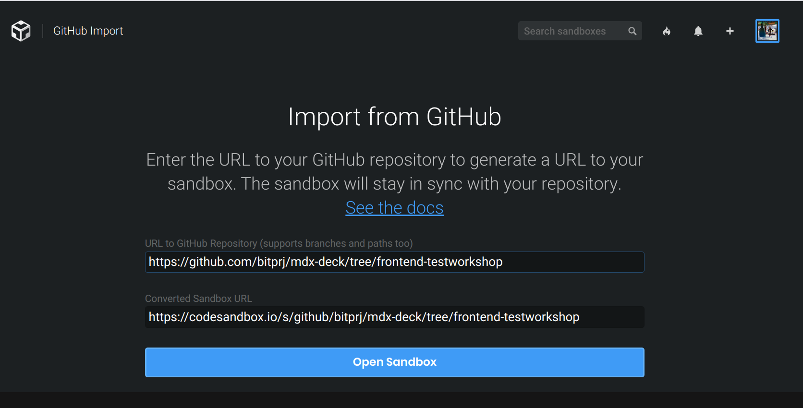
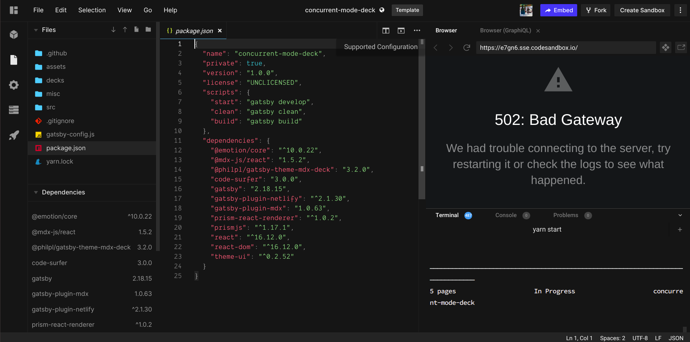
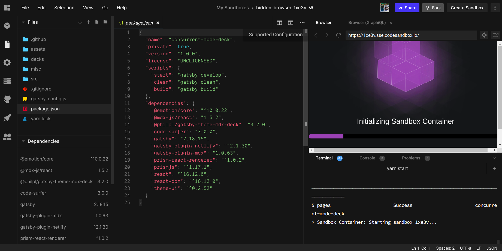
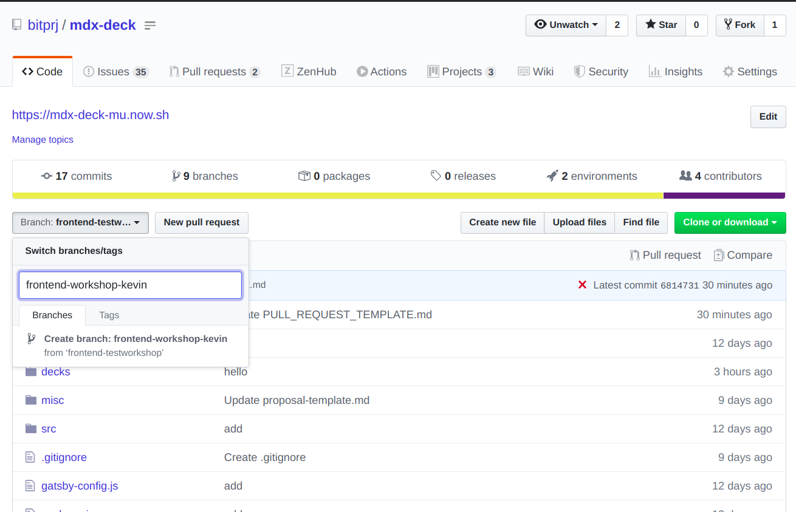
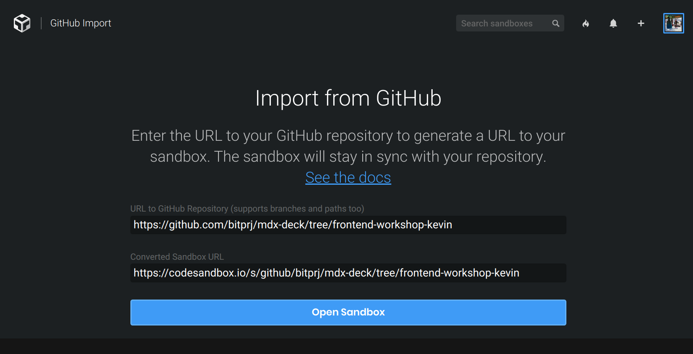
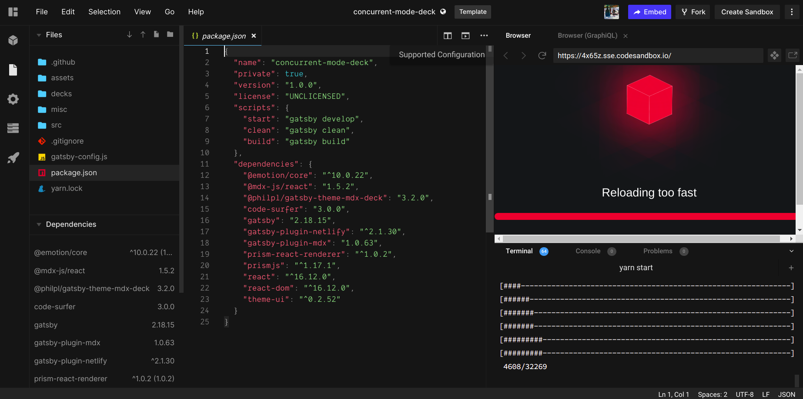
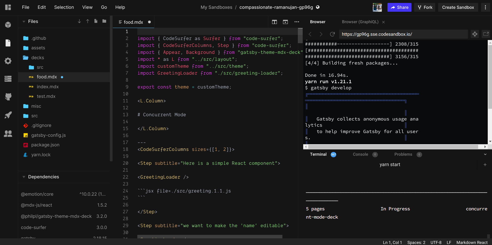
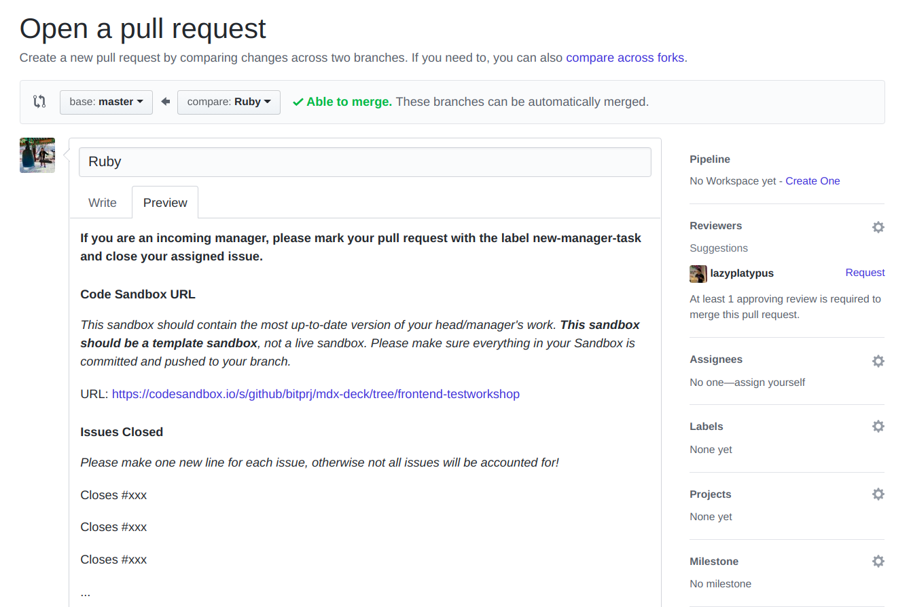
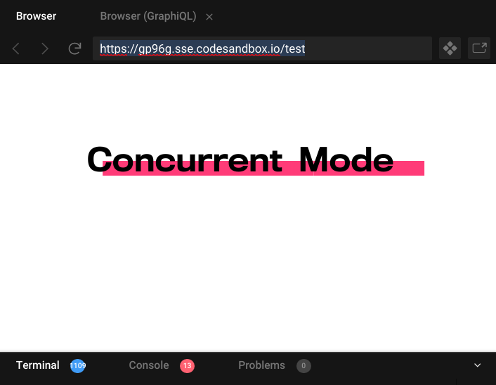

# Setting up Code Sandbox

## For Managers/Incoming Managers

Firstly, set up a branch at our workshops [repository](https://github.com/bitprj/mdx-deck). You should branch **from master** and call your branch "dept\_name-workshop\_name" \(note that the workshop\_name does not have to be an extensive name - one word will do.

E.g. a branch for a COVID-19 workshop utilizing Postman's visualizer \(in the front-end department\) would have the name "frontend-covid19".


Next, copy your branch's URL and head over to Code Sandbox [here](https://codesandbox.io/s/github). Where it says "URL to Github Repository", copy and paste your branch's URL. You should have a Code Sandbox URL automatically populate underneath.  Click on "Open Sandbox".

2



After loading packages, a page like this should appear. Note that Code Sandbox automatically creates a template. **Keep track of this template's URL, you will use it in your pull requests.** This template keeps up to date with the latest version of your branch as new commits are pushed, so it is not editable. 



While your sandbox is loading, fork your sandbox on the top-right corner. You have now created a live sandbox which you can edit! It is also directly linked to your branch in GitHub. 



**Please also keep track of this live sandbox URL.** You can refer back to this URL to view your presentation files and see how your actual presentation changes in response to your changes, all in one place! **You can always come back to this URL when making edits to your branch.**

#### Quality Assurance

When you are reviewing your developers' work to meet the Friday/Sunday deadlines, you should go through the presentation on Code Sandbox, and leave PR review comments on the appropriate lines of code via GitHub. 

## For Developers

_Note that because Code Sandbox supports collaborative coding a la Google Drive, one or both developers can work on the following steps, depending on whether you and your partner wish to work in the same sandbox or not. Working separately will also mean you will be working in separate GitHub branches._

Per the Manager's instructions above, your manager should have already set up a GitHub branch for your workshop. **If this has not happened, please contact your manager immediately.**

Head to your manager's set-up branch, and **make a branch from your manager's branch.** You should name your branch with the name of your manager's branch + your own name. E.g. if your manager's branch is `frontend-covid19` you should name your branch `frontend-covid19-your_name`.



Next, copy your branch's URL and head over to Code Sandbox [here](https://codesandbox.io/s/github). Where it says "URL to Github Repository", copy and paste your branch's URL. You should have a Code Sandbox URL automatically populate underneath.  Click on "Open Sandbox".



After loading packages, a page like this should appear. Note that Code Sandbox automatically creates a template. **Keep track of this template's URL, you will use it in your pull requests.** This template keeps up to date with the latest version of your branch as new commits are pushed, so it is not editable. 



While your sandbox is loading, fork your sandbox on the top-right corner. You have now created a live sandbox which you can edit! It is also directly linked to your branch in GitHub. 


**Please also keep track of this live sandbox URL.** You can refer back to this URL to view your presentation files and see how your actual presentation changes in response to your changes, all in one place! **You can always come back to this URL when making edits to your branch.**

## General Tips

### Using Other Languages

If you want to use a non-JavaScript language in your presentation, you can use any of these languages: [https://prismjs.com/\#supported-languages](https://prismjs.com/#supported-languages). You **must include the following code statement on the top of your code:**

```text
import "prismjs/components/prism-<insert_language_here>";
```

&lt;insert\_language\_here&gt; would reference the language alias found at the prism.js link above. 

For example, if I wanted to import Python, I would paste the following statement on the top of my mdx file:

```text
import "prismjs/components/prism-python";
```

Additional details can be found [here](https://github.com/pomber/code-surfer#languages).

Now to integrate a Python code block, I can start a Markdown code block and specify the Python language:

```text
---
```python
def hello():  
    print("Hello")
```
---
```

The above code would make an entire slide with that Python code block in the middle.

### Communication Using Code Sandbox

As a manager or developer, you would like to be on the same page regarding everything related to your workshop. If there are any questions or concerns about others' work, you should proactively look at their sandbox and see what they have developed. Code Sandbox is a _collaborative platform,_ and questions can be easily ironed out via a Zoom call and working together on a common Sandbox. 

### Saving Files

Before making any changes on GitHub, you have to save all of your changes. Near the top of the code editor, each file you have edited will have a white dot next to it if there are unsaved changes. Make sure to click CTRL + S to save your changes and ensure your changes are in the next commit.



### Committing

Code Sandbox integrates well with GitHub. On the very left toolbar, click on the GitHub logo. You should see your changes pop up in that menu. Be sure to **commit** your changes. When you commit, those changes are automatically pushed to your branch!


### Pull Requests 

When submitting your work for a pull request, you should submit all pull requests in the GitHub UI. Head to your branch on GitHub and make a pull request from there. **Be sure to include the Code Sandbox template URL that you have been working in your pull request.** 



### Viewing Presentation in Full Screen

If you would like to test your presentation with the full browser screen and not the small browser screen within Code Sandbox, you can copy the URL within the Sandbox browser and paste it into a new tab to see the full screen version.




